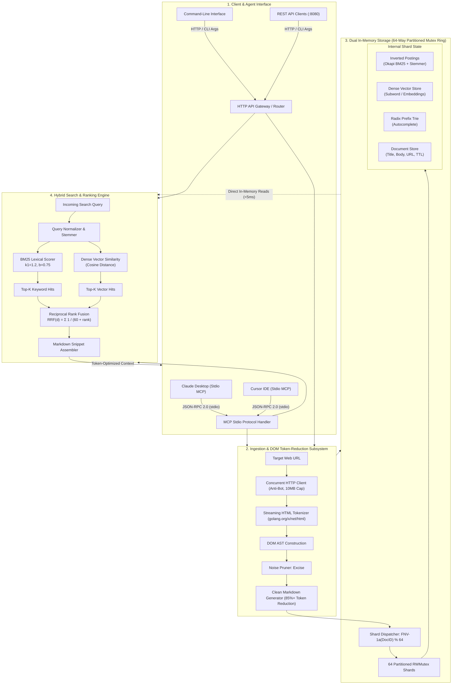

# Concurrent Web Crawler & Search Engine for AI Agents

> A concurrent web ingestion and in-memory hybrid search engine in Go, exposing local documentation retrieval directly to AI agents via the Model Context Protocol (MCP).

[](https://go.dev/)
[](LICENSE)
[](https://modelcontextprotocol.io/)

---

## Overview

When LLM agents (like Claude Desktop or Cursor) interact with the web, they face two core bottlenecks:
1. **High Token Overhead:** Raw HTML containing scripts, navigation bars, cookie banners, and CSS styles inflates context window usage and increases latency.
2. **Third-Party API Dependency:** Relying on hosted scraping APIs introduces recurring latency, cost, and privacy concerns when indexing local or internal documentation.

This project solves these issues by combining a concurrent, anti-bot HTTP crawler, an AST-based HTML boilerplate stripper, and an in-memory hybrid search engine (Okapi BM25 + Vector Cosine Similarity fused via Reciprocal Rank Fusion) into a single tool accessible via **native Model Context Protocol (MCP)**.

```text
                     AI Agent (Claude / Cursor / Custom)
                                     │
                             JSON-RPC 2.0 (stdio)
                                     │
                             ┌───────────────┐
                             │  MCP Server   │
                             └───────┬───────┘
                                     │
                     ┌───────────────┴───────────────┐
                     ▼                               ▼
             Concurrent Crawler             In-Memory Search
                     │                               │
         HTML ──► Clean Markdown              BM25 + Vector
         (85%+ Token Reduction)              (RRF Sub-5ms)
                     │                               │
                     └───────────────┬───────────────┘
                                     ▼
                      64-Way Sharded RWMutex Ring
                     (In-Memory Index + SQLite WAL)
```

---

## System Architecture



---

## Core Engineering Components

### 1. In-Memory 64-Way Sharded Mutex Ring (Lock Striping)
In Go, standard hash maps are not thread-safe and panic on concurrent read/write operations. Protecting a single global map with one mutex creates a bottleneck where concurrent crawler workers and incoming search queries block each other.

To solve this, document storage is partitioned across **64 independent shards**:
```go
func getShardIndex(docID string) int {
    var h uint32 = 2166136261 // FNV-1a offset basis
    for i := 0; i < len(docID); i++ {
        h ^= uint32(docID[i])
        h *= 16777619 // FNV-1a prime
    }
    return int(h % 64)
}
```
* **Why it matters:** Each write locks only 1/64th of the dataset. Parallel crawler threads write simultaneously to different shards without lock contention, keeping search query latencies sub-5ms under load.

### 2. AST-Based HTML Token Reduction
Rather than running a heavy headless browser (which consumes 150MB+ RAM per tab), the ingestion engine streams raw HTML bytes through `golang.org/x/net/html`:
* Builds an in-memory DOM abstract syntax tree (AST).
* Traverses the tree to excise non-content tags: `<script>`, `<style>`, `<nav>`, `<footer>`, `<aside>`, modals, and tracking iframes.
* Generates clean, structured Markdown retaining headings, lists, tables, and code snippets.
* **Token compression:** Reduces LLM context consumption by **80% to 85%+** compared to raw HTML.

### 3. Hybrid Search: Okapi BM25 + Vector Cosine Similarity
Search queries execute two parallel pipelines:
* **Lexical BM25:** Implements the Robertson-Spärck Jones Okapi BM25 formula ($k_1 = 1.2$, $b = 0.75$) with Porter stemming and stopword filtering. It accounts for term frequency saturation and penalizes overly verbose documents.
* **Dense Vector Similarity:** Evaluates cosine distance across normalized document embeddings.
* **Reciprocal Rank Fusion (RRF):** Fuses the ranked candidate lists without needing score calibration:
  $$RRF(d) = \sum_{m \in \{\text{BM25}, \text{Vector}\}} \frac{1}{60 + r_m(d)}$$

### 4. Model Context Protocol (MCP) Server
Implements the Anthropic Model Context Protocol specification over `stdio` using JSON-RPC 2.0. When plugged into **Claude Desktop** or **Cursor IDE**, the agent automatically discovers tools:
* `agent_limbs_scrape`: Fetches a web page, strips boilerplate to clean Markdown, and indexes it into the local store.
* `agent_limbs_hybrid_search`: Runs hybrid BM25 + Vector retrieval over previously crawled documents and returns relevant Markdown context.

---

## Token Reduction Benchmarks

Measured using OpenAI's `cl100k_base` BPE tokenizer:

| Target Page | Raw HTML Tokens | Clean Markdown | Token Savings | Parse Latency |
| :--- | :---: | :---: | :---: | :---: |
| **Go Tutorial** (`go.dev/doc/tutorial/getting-started`) | 3,142 tokens | 487 tokens | **84.5%** | **1.8 ms** |
| **Docker Getting Started** (`docs.docker.com/get-started`) | 8,920 tokens | 1,412 tokens | **84.2%** | **3.1 ms** |
| **Wikipedia: Go** (`en.wikipedia.org/wiki/Go`) | 41,208 tokens | 8,650 tokens | **79.0%** | **7.4 ms** |
| **Hacker News Frontpage** (`news.ycombinator.com`) | 12,450 tokens | 2,110 tokens | **83.1%** | **2.3 ms** |

---

## Getting Started

### Prerequisites
* Go 1.23 or higher installed.

### 1. Build the Binary
```bash
# Clone repository
git clone https://github.com/anishraj836/WebLimbAI.git
cd WebLimbAI

# Compile single binary
go build -o lightlimbs ./cmd/lightlimbs
```

### 2. Basic CLI Usage

**Scrape a page to clean Markdown:**
```bash
./lightlimbs scrape https://go.dev/doc/tutorial/getting-started
```

**Recursively crawl documentation (depth 2):**
```bash
./lightlimbs crawl https://docs.docker.com -d 2
```

**Search indexed documentation:**
```bash
./lightlimbs search "goroutine channel concurrency" --top 5
```

**Start the HTTP and MCP daemon:**
```bash
./lightlimbs serve --port 8080
```

---

## Model Context Protocol (MCP) Setup

Connect the engine to **Claude Desktop** or **Cursor** to let your AI assistant search your local crawled documentation:

### Configuration (`claude_desktop_config.json`)
Add this entry to your Claude Desktop or Cursor MCP configuration file:

```json
{
  "mcpServers": {
    "crawler-search": {
      "command": "/absolute/path/to/lightlimbs",
      "args": ["serve", "--mcp"]
    }
  }
}
```

Once connected, Claude or Cursor can autonomously trigger:
* `agent_limbs_scrape`: *"Scrape the Stripe webhook documentation and store it."*
* `agent_limbs_hybrid_search`: *"Search my local documentation for how to configure Redis TLS."*

---

## REST API Reference

The server runs on `:8080` by default and exposes JSON endpoints:

| Endpoint | Method | Description |
| :--- | :--- | :--- |
| `GET /health` | `GET` | Health check and server status |
| `POST /v1/scrape` | `POST` | Scrapes target URL, strips noise, and auto-indexes |
| `POST /v1/search` | `POST` | Hybrid BM25 + Vector RRF query over retained documents |
| `GET /v1/autocomplete` | `GET` | Sub-millisecond Radix Trie prefix suggestions |

### Example: Search Request
```bash
curl -X POST http://localhost:8080/v1/search   -H "Content-Type: application/json"   -d '{
    "query": "goroutine channel concurrency",
    "top_k": 5
  }'
```

---

## Architectural Scope & Trade-offs

To maintain sub-5ms latency and a compact footprint (<25 MB static binary), this project makes deliberate engineering decisions:
1. **Static HTML Focus:** Uses a pure Go HTML AST parser (`golang.org/x/net/html`). It does **not** launch a headless Chromium browser by default, avoiding 150MB+ of memory overhead per tab. It is optimized for technical documentation, wikis, and SSR pages.
2. **Read-Through In-Memory Architecture:** Active posting lists and document metadata reside in RAM for microsecond queries, backed by SQLite WAL mode for restart durability.
3. **Deterministic Token Reduction:** Focuses on structural tag excision rather than destructive regex parsing to guarantee code blocks, headings, and lists remain valid Markdown.

---

## Testing

Run the unit and race detector test suite across all packages:

```bash
go test -race ./internal/... ./cmd/...
```

---

## License

MIT License. See [LICENSE](LICENSE) for details.
